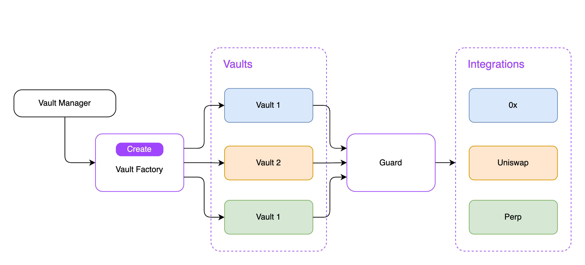

## How Vaults.pro works (draft)



Vaults.pro is secure and non-custodial asset management protocol offering access to spot markets, yield, options, lending, perpetuals, leverage and more.

Anyone can create a new vault and manage assets over secure layer of integrations with dozen platforms over smart `Guard` layer which protects over malicious attacks from third parties.

## Architecture

### Factory

Creates and deploys smart contract for a new vault.

```solidity
pragma solidity >=0.5.0;

interface IVaultsV1Factory {
  event OwnerChanged(address indexed oldOwner, address indexed newOwner);
  event VaultCreated(string indexed name);

  function owner() external view returns (address);
  function setOwner(address _owner) external;

  function getVault(string name) external view returns (address vault);
  function createVault(string name) external returns (address vault);
}
```

### Vault

Stores assets of the vault and provide access to management tools.

```solidity
pragma solidity >= 0.5.0;

interface IVaultsV1Vault {
  event OwnerChanged(address indexed oldOwner, address indexed newOwner);
  event Swap(address integration, int256 amount0, int26 amount1, uint160 price);

  function owner() external view returns (address);
  function setOwner(address _owner) external;

  function swap(
    address integration,
    address token0,
    address token1,
    int256 amount,
    uint160 price
  ) external returns (int256 amount0, int256 amount1);
}
```

### Guard

Proxy transactions between `Vault` and `Integration`

```solidity
pragma solidity >= 0.5.0;

interface IVaultsV1Guard {
  event OwnerChanged(address indexed oldOwner, address indexed newOwner);
  event IntegrationAdded(address indexed intergration);
  event IntegrationRemoved(address indexed intergration);

  function owner() external view returns (address);
  function setOwner(address _owner) external;

  function addIntegration(address integration);
  function removeIntegration(address integration);

  function swap(
    address integration,
    address token0,
    address token1,
    int256 amount,
    uint160 price
  ) external returns (int256 amount0, int256 amount1);
}
```

### Integration

Implements integration layer between `Vaults.pro` and specific platform

```solidity
pragma solidity >= 0.5.0;

interface IVaultsV1Integration {
  event OwnerChanged(address indexed oldOwner, address indexed newOwner);

  function owner() external view returns (address);
  function setOwner(address _owner) external;

  function swap(
    address token0,
    address token1,
    int256 amount,
    uint160 price
  ) external returns (int256 amount0, int256 amount1);
}
```
